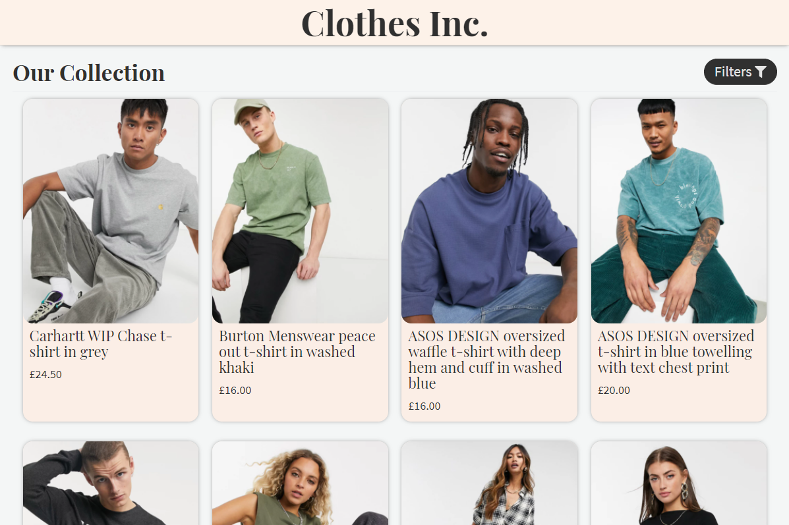
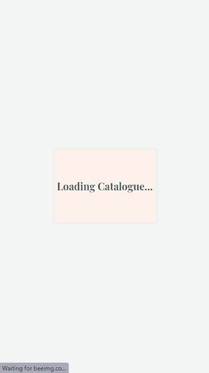

  

  <h1 align="center">🧥 👖 Clothes Inc.</h1>

<h3 align='center'>
    A Fully Responsive Clothes Catalogue and Store Built with React & Redux
</h3>

     
    <a href="https://clothes-inc.herokuapp.com/"><strong>Visit The Site »</strong></a>
     
     
    <a href="https://github.com/Rhelli/react-redux-capstone---clothes-catalogue-store/archive/feature/readMe.zip">Download this repository</a>
    |
    <a href="https://github.com/Rhelli/react-redux-capstone---clothes-catalogue-store/issues/new/choose">Report A Bug</a>
    |
    <a href="https://github.com/Rhelli/react-redux-capstone---clothes-catalogue-store/fork">Fork It</a>
  

## 📑 Table of Contents
  - [The Project Brief](https://github.com/Rhelli/react-redux-capstone---clothes-catalogue-store/tree/feature/readMe#-the-project-brief)
  - [The Technical Requirements](https://github.com/Rhelli/react-redux-capstone---clothes-catalogue-store/tree/feature/readMe#%EF%B8%8F-the-nitty-gritty)
  - [Architecture](https://github.com/Rhelli/react-redux-capstone---clothes-catalogue-store/tree/feature/readMe#architecture)
  - [Tools & Technology Used](https://github.com/Rhelli/RoR-Capstone---Activity-Tracker/tree/release/0.1.0#-tools--technology-used)
  - [Setup & Use](https://github.com/Rhelli/react-redux-capstone---clothes-catalogue-store/tree/feature/readMe#-setup--use)
  - [Showcase](https://github.com/Rhelli/react-redux-capstone---clothes-catalogue-store/tree/feature/readMe#-feature-previews)
  - [Contributions, Issues and Forking](https://github.com/Rhelli/react-redux-capstone---clothes-catalogue-store/tree/feature/readMe#%EF%B8%8F-contributions-issues-and-forking)
  - [Creator](https://github.com/Rhelli/react-redux-capstone---clothes-catalogue-store/tree/feature/readMe#-creator)
  - [Show Your Support!](https://github.com/Rhelli/react-redux-capstone---clothes-catalogue-store/tree/feature/readMe#-show-your-support)
  - [Credit & Acknowledgements](https://github.com/Rhelli/react-redux-capstone---clothes-catalogue-store/tree/feature/readMe#-credits--acknowledgements)
  - [Licensing](https://github.com/Rhelli/react-redux-capstone---clothes-catalogue-store/tree/feature/readMe#%EF%B8%8F-licensing)

## 🔰 The Project Brief

This is the React & Redux capstone project, to be completed by all students of [Microverse](https://www.microverse.org/).

Unlike the projects in the React & Redux module before, this project is performed under timed conditions with milestones, and comes complete with a project brief, business specifications and technical requirements. The purpose of such an undertaking, is to provide and practice scenarios which more closely adhere to the real world - we're not always given an indefinite amount of time and the complete picture, so it pays to practice producing quality software under pressure.

This capstone in particular, following the React & Redux module, focuses on consolidating our acquired skills in both domains. In order to complete this capstone successfully, we are tasked with creating a React web app to the given specification, with either React Hooks, or Redux utilisation for state management.

## 🚦 The Technical Requirements
This particular project tasked us with creating a catalogue for clothes. The original specification and design for the project followed those of [Denys Chagaida's 'Pimp My Dog Online Store'](https://www.behance.net/gallery/24531031/Pimp-my-DOG-Online-store-E-commerse-project), however, as we were not required to adhere to and directly clone the original design (although it was an option), I opted to change the basis for the store and create the archetypal online clothes store commonly seen today.

Within our provided project requirements, it was stated that we must build the page with at least two types of page:
 - One page where all the displayed items could be filtered via given parameters
 - A second page for the item details

Additionally, was the extra stipulation that our app must collect data to be used in our web app **externally**. This was to be performed by means of asynchronous API calls.

## ⚙️ Architecture
### File Structure
  The file structure of this app uses a [View-State Split](https://www.pluralsight.com/guides/how-to-organize-your-react-+-redux-codebase) design, in order to entirely separate each components state management, from it's view.

  The choice for using such a file structure is that it is exceedingly easy to visualise and organise the state of the project - there is no room for confusion. Additionally all redux code is located in one place, with the (predominantly) React based code location in another.

### JSON Design & API
  Whilst this project required we draw our data into the app from an external source, in searching, I could not find a suitable API which both offered a substantial amount of free calls, nor the desired data-sets.

  Instead, I decided to design and implement my own API solution, using [JSONBIN.io](https://jsonbin.io/). The JSONBIN platform allows you as a user to upload your own JSON data to their web service, store it, and then securely access it via an API call. The folder named `Clothes Assets` found at root, houses the raw assets initially acquired in order to build the relevant API data required in order to make this project.

  Images were hosted on [BeeIMG](https://beeimg.com/) and their URLs we're added to each JSON clothing product.

### API Calls
  API calls are performed using [Axios](https://github.com/axios/axios) and [Redux-Thunk](https://github.com/reduxjs/redux-thunk) middleware has been implemented to handle the successful (or, unsuccessful) API return and store it into the Redux state immediately.

### Application State
  The state for this application was largely maintained using Redux, with the occasional use of Redux hooks.

## 🧰 Languages, Frameworks and Build Tools Used
**Languages & Frameworks**
 - HTML5
 - SASS
 - ES6 Javascript
 - React
 - Redux
 - NPM

**NPM Packages Of Note**
 - [PropTypes](https://reactjs.org/docs/typechecking-with-proptypes.html)
 - [Axios](https://github.com/axios/axios)
 - [FontAwesome](https://fontawesome.com/)
 - [React-Router-DOM](https://reactrouter.com/web/guides/quick-start)
 - [Redux-Thunk](https://github.com/reduxjs/redux-thunk)
 - [SwiperJS](https://swiperjs.com/)

**Testing**
 - [Jest](https://jestjs.io/)

**Linters & Quality Control**
 - [ESLint](https://eslint.org/)
 - [StyleLint](https://stylelint.io/)

**Deployment**
 - Heroku

### 🚀 Setup & Use
[Head here](https://clothes-inc.herokuapp.com/) if you'd like to see the live site. If you'd like a closer look, continue reading....

#### Setup
If you would like to tinker with this project a little more, then we will have to ensure your machine is correctly setup.

  1. Ensure that you have [Node.js](https://nodejs.org/) installed on your machine. The project will not run without it.

  2. Time to download this repository. Either download the repository [here](https://github.com/Rhelli/react-redux-capstone---clothes-catalogue-store/archive/feature/readMe.zip) or clone this repository onto your computer. [Not sure what 'Cloning' is? Follow this guide.](https://docs.github.com/en/github/creating-cloning-and-archiving-repositories/cloning-a-repository)

  3. Once you have this project downloaded or cloned to your machine, `cd` to the root of the project in your terminal. [Not sure what 'CD' means? Follow this guide.](https://www.macworld.com/article/2042378/master-the-command-line-navigating-files-and-folders.html)

  4. Time for the last step of setup! Type `npm install` into your terminal. This will install all the required packages and software that your machine does not already have.

#### Usage
Whilst this project has been predominantly built for use as a web page, there are still a few commands you can use to interact with the project:

 - `npm start` - This will start up the project in your default browser. From here, any changes made to the project will update in real time.
 - `npm test` - This will run all implemented tests using Jest.
 - `npm build` - This will build a static, production build of the project.

******

## 🎟️ Feature Previews
### Desktop Demo

> A quick look through Clothes Inc, displaying the loading screen whilst API data is collected, the home screen, the clothes filters and finally the individual product page.

### Mobile Demo

> The design of the site is maintained in the mobile view, however everything is shrunk down and resized in order to maintain a pleasant web experience.

*******

## 🛎️ Contributions, Issues and Forking

Contributions, issues and feature requests are not just welcome, but encouraged!

First and foremost, if you have any problems running or setting this project up, please submit it as a bug on the [issues page.](https://github.com/Rhelli/react-redux-capstone---clothes-catalogue-store/issues/new/choose) right away!

If you want to make your own changes, modifications or improvements, go ahead and Fork it!
1. [Fork it](https://github.com/Rhelli/react-redux-capstone---clothes-catalogue-store/fork)
2. Create your working branch (git checkout -b [choose-a-name])
3. Commit your changes (git commit -am 'what this commit will fix/add/improve')
4. Push to the branch (git push origin [chosen-name])
5. Create a new Pull Request

## 💂🏽💻 Creator

Rory Hellier - [Github](https://github.com/Rhelli)

## 🖐🏼 Show Your Support!
If enjoyed this project, thought the implementation was good or even liked the colour scheme, please do give the project a 🌟. It makes a huge difference!

## 🍻 Credits & Acknowledgements
All images and clothing information contained within this app are sourced from [ASOS](www.asos.com). All credit goes to them for supplying the assets for this project.

## ⚖️ Licensing
This project is [MIT](https://github.com/Rhelli/react-redux-capstone---clothes-catalogue-store/blob/feature/readMe/LICENSE.txt) licensed.
